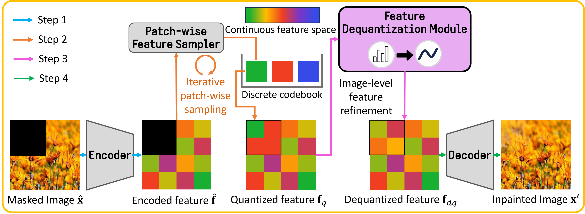

# FDM: Improving Detail in Pluralistic Image Inpainting with Feature Dequantization
This repository is the official implementation of WACV2025 paper [Improving Detail in Pluralistic Image Inpainting with Feature Dequantization](https://arxiv.org/abs/2412.01046).



## Environment setup
```
git clone https://github.com/hyudsl/FDM.git
cd FDM

conda create -n FDM python==3.8
conda activate FDM

# install pytorch
conda install pytorch torchvision torchaudio pytorch-cuda=11.8 -c pytorch -c nvidia

pip install -r requirements.txt
```

## Prepare dataset
Please refer to each link to download the dataset.
* [Places](http://places2.csail.mit.edu) \
We use subset of Places365-Challenge following [PUT](https://github.com/liuqk3/PUT). \
The list of used images is provided in [data/image_list/naturalscene/image_list.txt](https://github.com/hyudsl/FDM/blob/main/data/image_list/naturalscene/image_list.txt)

* [Paris Street View](https://github.com/pathak22/context-encoder)

* [Irregular mask dataset](https://nv-adlr.github.io/publication/partialconv-inpainting) \
We use the testing_mask_dataset, which can be downloaded [here](https://www.dropbox.com/s/01dfayns9s0kevy/test_mask.zip?dl=0)

## Training

Please ensure the data path is correct in each config file
```
# example

dataloader:
  data_root: ./data
  ...
  train_datasets:
    - target: image_synthesis.data.image_list_dataset.ImageListDataset
      params:
        name: images/paris/train
        ...
        provided_mask_name: masks
        ...
  val_datasets:
    - target: image_synthesis.data.image_list_dataset.ImageListDataset
      params:
        name: images/paris/val
        ...
        provided_mask_name: masks
        ...
```

### Phase 1: Training the base model (PUT)
#### i. Encoder-decoder
<!-- Training encoder-decoder using the following command. -->
Run the command to training encoder-decoder
```
python train_net.py --config_file path/to/encoder_decoder/config --output path/to/save
```
example
```
python train_net.py --config_file ./configs/paris/encoder_decoder.yaml --output ./output/experiments/paris
```
<!-- <details>
  <summary>OR You can make the weights provided by PUT compatible with the model architecture of FDM.</summary>
  ```
  d
  ```
</details> -->

#### ii. Patch-wise feature sampler
Set encoder-decoder path in config file
```
# example

model:
  ...
  params:
    ...
    codec_path: ./output/experiments/paris/encoder_decoder/checkpoint/last.pth
    ...
```

Run command to training feature sampler (Transformer)
```
python train_net.py --config_file path/to/feature_sampler/config --output path/to/save
```
example
```
python train_net.py --config_file ./configs/paris/transformer.yaml --output ./output/experiments/paris
```

### Phase 2: Training FDM
Set encoder-decoder path in config file
```
# example

model:
  ...
  params:
    ...
    codec_path: ./output/experiments/paris/encoder_decoder/checkpoint/last.pth
    ...
```

Run command to training FDM
```
python train_net.py --config_file path/to/fdm/config --output path/to/save
```
example
```
python train_net.py --config_file ./configs/paris/fdm.yaml --output ./output/experiments/paris
```

### Phase 3: Jointly fine-tuning FDM and the decoder
Set encoder-decoder path in config file
```
# example

model:
  ...
  params:
    ...
    codec_path: ./output/experiments/paris/fdm/checkpoint/last.pth
    ...
```

Run command to training FDM and decoder
```
python train_net.py --config_file path/to/fdm_tuning/config --output path/to/save
```
example
```
python train_net.py --config_file ./configs/paris/fdm_tuning.yaml --output ./output/experiments/paris
```

## Inference

Set inference configuration with follow structure
```
config_root
    L task1
        L dataloader.yaml
        L model.yaml
        L task_config.yaml
    L task2
    ...
```

Please ensure the data path is correct in dataloader.yaml
```
# example

dataloader:
  data_root: ./data
  ...
  params:
    name: images/paris/val  # image folder path in data_root
    image_list_file: path/to/image/list # txt file
    ...
    provided_mask_name: masks   # mask folder path in data_root
    provided_mask_list_file: path/to/mask/list # txt file
    ...
```

Set encoder-decoder (+FDM) and feature sampler path in model.yaml \
You can download the pre-trained models from [GoogleDrive](https://drive.google.com/drive/folders/127VxM-oSM9zjlRNZNrSgeDUC86inBYkj?usp=sharing).

```
# example

model:
  ...
  params:
    ...
    codec_path: ./paris/fdm_tuning.pth
    generator_path: ./paris/generator.pth
    ...

or

model:
  ...
  params:
    ...
    codec_path: ./output/experiments/paris/fdm_tuning/checkpoint/last.pth
    generator_path: ./output/experiments/paris/transformer/checkpoint/last.pth
    ...
```

You can set save path at task_config.yaml

Run command to inference
```
python inference.py --config path/to/config/root --task task/name
```
example
```
python inference.py --config ./configs/paris --task inpainting
```

## Acknowledgments
This repository is built on the [PUT](https://github.com/liuqk3/PUT)

## Citation
```
@misc{park2024improvingpluralisticimageinpainting,
      title={Improving Detail in Pluralistic Image Inpainting with Feature Dequantization}, 
      author={Kyungri Park and Woohwan Jung},
      year={2024},
      eprint={2412.01046},
      archivePrefix={arXiv},
      primaryClass={cs.CV},
      url={https://arxiv.org/abs/2412.01046}, 
}
```